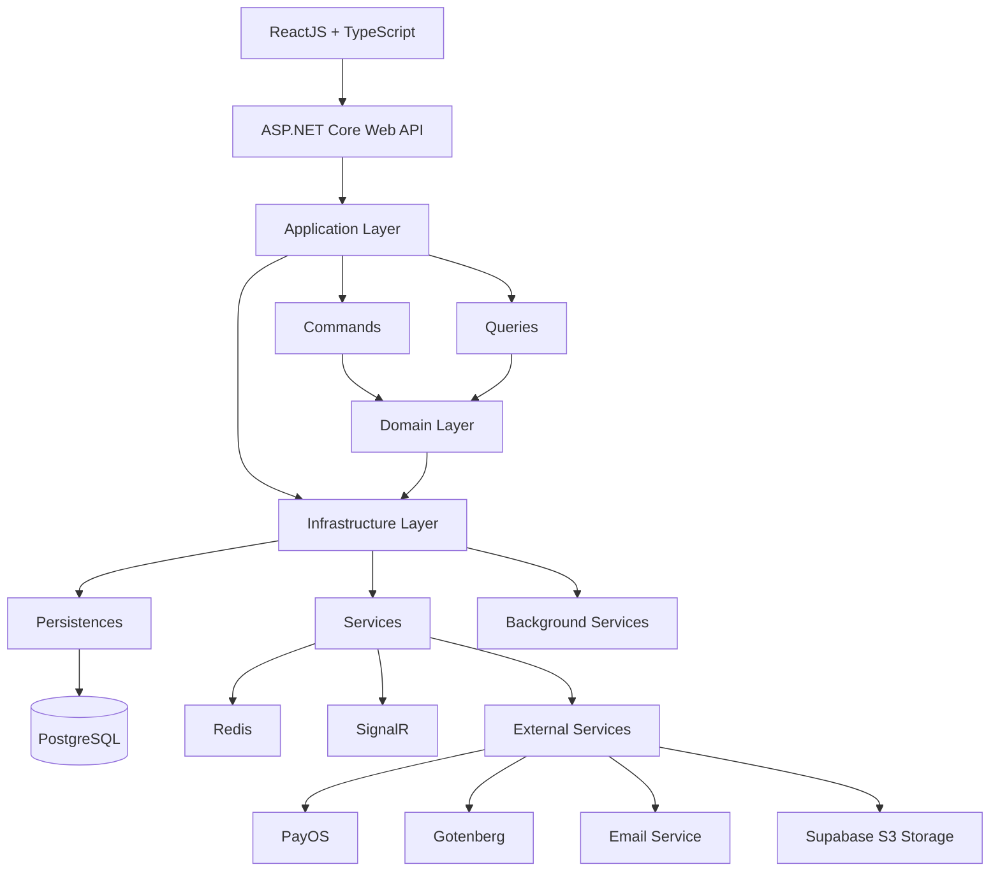

# Share Documents System

Share Documents System is a document management and sharing web application built with ASP.NET Core Web API and ReactJS.
The system allows users to upload, manage, search, preview, and share documents in a centralized platform. Documents can contain multiple files and can be organized using subjects, tags, and groups, making it easier for users to classify and discover shared resources.

---

## Table of Contents

- Overview
- Key Features
- System Architecture
- Tech Stack
- Project Structure
- Installation
- Configuration
- Third-Party Services
- Future Improvements

---

## Overview

Share Documents System is a web-based document management and sharing system built with ASP.NET Core Web API and ReactJS.

The system allows users to upload, organize, manage, preview, search, and share documents through a centralized platform. Documents can be categorized using subjects, tags, and groups, while uploaded files are stored using Supabase S3-compatible object storage.

The backend is designed using Clean Architecture and CQRS, with PostgreSQL, Entity Framework Core, JWT Authentication, SignalR, Redis, Gotenberg and Docker integrated to support security, real-time communication, document processing, and packging.

---

## Key Features

### User Features

- **Authentication & Account** 
  - Register & Login
  - Forgot Passowrd
  - JWT-based authentication and role-based authorization
  - Manage Profile
- **Membership & Payment**
  - View membership plans and subscription status
  - Process payments via PayOS and manage membership fee payment
- **Document Features**
  - Create, update, delete, restore documents
  - Bookmark documents
  - Download, preview files
  - View document details and personal documents
  - View, search, filter, and paginate documents
- **Document Group Features**
  - Create, update, delete, restore document groups
  - Search, filter, and paginate document groups
- **Comment**
  - Send, delete, reply comments to document
  - View comments on documents 
- **Notification**
  - Receive notifications
  - Mark notification as read
  - Real-time notifications

### Admin Features

- **Account Management**
  - View, search, and filter user accounts
  - Create, update, lock, unlock user account
  - Manage user roles
- **Document Management**
  - View, search, and filter system-wide documents
  - Create, update, delete, restore documents
  - View document details and personal documents
  - Download, preview files
  - Approve or Reject documents
- **Group Management**
  - View, search, and filter document groups
  - Approve or Reject document groups
- **Category Management**
  - **Faculty Management** — create, update, delete, restore, search, and filter
  - **Major Management** — create, update, delete, restore, search, and filter
  - **Subject Management** — create, update, delete, restore, search, and filter
  - **Tag Management** — create, update, delete, restore, search, and filter

---

## System Architecture

The backend follows the Clean Architecture pattern combined with CQRS (Command Query Responsibility Segregation) to achieve a clear separation of concerns, improve maintainability, and support future scalability.



---

## Tech Stack

| Category | Technologies |
|-----------|-------|
| **Frontend** | ReactJS, TypeScript, Vite |
| **Backend** | ASP.NET Core Web API, C# |
| **Database** | PostgreSQL, Entity Framework Core |
| **Authentication** | ASP.NET Core Identity, JWT Authentication |
| **Cache** | Redis |
| **Real-time Communication** | SignalR |
| **Payment Gateway** | PayOS |
| **Object Storage** | Supabase S3 Storage |
| **Document Processing** | Gotenberg |
| **Background Processing** | ASP.NET Core Background Service |
| **Validation & Mapping** | FluentValidation, Mapster |
| **Logging** | Serilog, Structured logging (Console + File sinks) |
| **Containerization** | Docker, Docker Compose, Nginx |
| **API Security** | CORS, Rate Limiting |
| **API Documentation** | Swagger / Swashbuckle  |
| **Asp.Versioning** | API versioning |

---

## Project Structure

```
ShareDocuments/
├── API-ShareDocuments/
│   ├── API-ShareDocuments/
│   │   ├── Configurations/            # Application middleware and request pipeline configuration
│   │   ├── Controllers/               # REST API endpoints
│   │   ├── Logs/                      # Serilog log files
│   │   ├── Properties/                # Launch settings and project properties
│   │   ├── Registers/                 # Dependency injection and service registration            
│   ├── Application/
│   │   ├── Behaviors/                 # MediatR pipeline behaviors such as validation, logging, transaction, and exception handling
│   │   ├── CQRS/                      # CQRS implementation containing Commands, Queries, Handlers, and DTOs
│   │   ├── Common/                    # Shared application models (API responses, pagination)
│   │   ├── Events/                    # Application event definitions and event handlers
│   │   ├── Exceptions/                # Custom application exceptions and exception-related abstractions
│   │   ├── Hubs/                      # SignalR hub contracts, abstractions, and real-time communication definitions
│   │   ├── Interfaces/                # Application contracts for services, repositories, Unit of Work, storage
│   │   ├── Mappers/                   # Mapster configuration
│   │   ├── ApplicationDI.cs           # Dependency injection registration
│   ├── Domain/
│   │   ├── Common/                    # Base domain classes such as BaseEntity and BaseDomainEntity
│   │   ├── Entities/                  # Core business entities and domain models
│   │   ├── Enums/                     # Domain-specific enumerations
│   │   ├── Events/                    # Domain event definitions
│   │   ├── Identity/                  # Identity-related domain models
│   ├── Infrastructure
│   │   ├── BackgroundServices/        # Background jobs and hosted services for asynchronous or scheduled tasks
│   │   ├── Configurations/            # Infrastructure configuration options
│   │   ├── Migrations/                # Entity Framework Core database migrations
│   │   ├── Persistences/              # Database context, EF Core configurations, and persistence-related components
│   │   ├── Services/                  # Implementations of external services such as storage, email, conversion, and authentication
│   │   ├── Repositories/              # Repository implementations for database access
│   │   ├── UnitOfWork/                # Unit of Work implementation for coordinating database operations and transactions
│   │   ├── InfrastructureDI.cs        # Dependency injection registration
│   └── Shared/
│   │   ├── Helpers/                   # Shared helper classes and utility functions
│   │   ├── Identity/                  # JWT settings and authentication models
│   │   ├── Logger/                    # Centralized logging utilities
│
├── UI-FlightSystem
│   ├── src/
│   │   ├── app/                       # Application-level setup, providers, and state management
│   │   ├── assets/                    # Static frontend assets
│   │   ├── common/
│   │   │   ├── api/                   # Shared API clients and HTTP request configurations
│   │   │   ├── components/            # Reusable UI components shared across multiple features
│   │   │   ├── constants/             # Shared application constants and configuration values
│   │   │   ├── hooks/                 # Custom reusable React hooks
│   │   │   ├── types/                 # Shared common API and PageList return types
│   │   │   ├── utils/                 # Shared utility and helper functions
│   │   ├── config/                    # Frontend environment configuration
│   │   ├── features/                  # Feature-based modules encapsulating UI, logic, and state
│   │   ├── modules/                   # Core UI presentation layers and main page views
│   │   ├── routes/                    # Application route definitions and route guards
│   │   └── styles/                    # Files CSS for user interface
│   ├── public/
```

---

## Installation

### 1. Prerequisites

Before running the project, make sure the following tools are installed:
- .NET 8 SDK 
- Node.js (v22 or later)
- PostgreSQL
- Docker Desktop
- Supabase account
- Gotenberg

Verify the installation:
```bash
dotnet --version
node --version
npm --version
docker --version
git --version
```

### 2. Clone Repository

Clone the repository and navigate to the project directory:
```bash
git clone https://github.com/Tanhhh1/Share-Documents.git
cd ShareDocuments
```

### 3. Configure Backend

Create or update the backend configuration file:
API-ShareDocuments/API-ShareDocuments/appsettings.json
See the ##Configuration section for more details.

### 4. Start Required Services

Start PostgreSQL, Redis, Gotenberg, and other required services using Docker Compose:
```bash
docker compose up -d
```
Check the running containers:
```bash
docker compose ps
```

### 5. Run Backend

Apply Entity Framework Core migrations:
```bash
dotnet ef database update
```

Start the ASP.NET Core Web API:
```bash
dotnet run
```
The API will be available at the URL configured in `launchSettings.json`.

### 6. Run Frontend

Install dependencies:
```bash
npm install
```
Start the React development server:
```bash
npm run dev
```

---

## Configuation

Before starting the application, configure the required settings in appsettings.json (or environment variables)
```
{
  "Supabase": {
    "Url": "",
    "Bucket": "",
    "SecretKey": ""
  },
  "Gotenberg": {
    "BaseUrl": ""
  },
  "EmailSettings": {
    "SmtpServer": "",
    "Port": ,
    "SenderEmail": "",
    "SenderPassword": "",
    "SenderName": "",
    "EnableSsl": 
  },
  "PayOSSettings": {
    "ClientId": "",
    "ApiKey": "",
    "ChecksumKey": "",
    "ReturnUrl": "",
    "CancelUrl": ""
  },
  "JwtConfiguration": {
    "SecretKey": "",
    "ValidAudience": "",
    "ValidIssuer": "",
    "TokenValidityInHours": ,
    "RefreshTokenValidityInDays": 
  },
  "Database": {
    "Main": ""
  },
  "RedisSettings": {
    "ConnectionString": ""
  },
}
```

---

## Third-Party Services

The system integrates with several third-party services to provide document storage, document processing, payment, email, and caching capabilities.

### Supabase

Used as an S3-compatible object storage service for storing uploaded document files and generated files.

- Store original document files
- Store converted PDF files for preview
- Store document thumbnails
- Generate and manage file access

### Gotenberg

Used for document conversion and PDF generation.

- Convert DOCX and PPTX files to PDF
- Generate PDF files for document preview
- Provide a consistent document conversion service

### PayOS

Used as the payment gateway for membership subscriptions.

- Create payment links
- Process membership payments
- Handle payment callbacks
- Update membership status after successful payment

### SMTP Email Service

Used for sending system emails.

- Password reset emails
- Membership-related notifications

### Redis

Used as an in-memory data store for application caching and temporary data.

- Cache frequently accessed data
- Store temporary application data
- Improve application response time

### SignalR

Used for real-time communication between the backend and frontend.

- Real-time notifications
- Push updates to connected users
- Maintain persistent client-server connections

---

## Future Improvements

The following improvements could be considered for future versions of the system:

- **Advanced Search** — Improve document search with full-text search, advanced filters, and relevance-based results.
- **Document Versioning** — Support multiple versions of the same document and allow users to view or restore previous versions.
- **File Sharing & Access Control** — Provide more granular permissions for sharing documents with specific users or groups.
- **Audit Logging** — Track important user and administrative activities for better monitoring and accountability.
- **Monitoring & Observability** — Add centralized metrics, health monitoring, and distributed tracing.
- **Cloud Deployment** — Deploy the application and infrastructure to a cloud environment with CI/CD automation.


---
