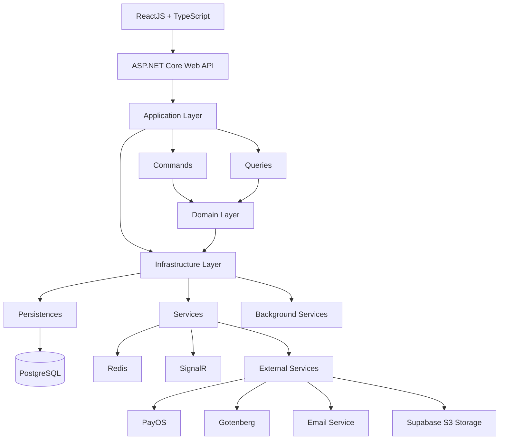

# Share Documents System

Share Documents System is a document management and sharing web application built with ASP.NET Core Web API and ReactJS.
The system allows users to upload, manage, search, preview, and share documents in a centralized platform. Documents can contain multiple files and can be organized using subjects, tags, and groups, making it easier for users to classify and discover shared resources.

---

## Table of Contents

- Overview
- Key Features
- System Architecture
- Tech Stack
- Project Structure
- Installation
- Configuration
- Authentication & Authorization
- Third-Party Services
- Future Improvements

---

## Overview

Share Documents System is a web-based document management and sharing system built with ASP.NET Core Web API and ReactJS.

The system allows users to upload, organize, manage, preview, search, and share documents through a centralized platform. Documents can be categorized using subjects, tags, and groups, while uploaded files are stored using Supabase S3-compatible object storage.

The backend is designed using Clean Architecture and CQRS, with PostgreSQL, Entity Framework Core, JWT Authentication, SignalR, Redis, Gotenberg and Docker integrated to support security, real-time communication, document processing, and packging.

---

## Key Features

### User Features

- **Authentication & Account** 
  - Register & Login
  - Forgot Passowrd
  - JWT-based authentication and role-based authorization
  - Manage Profile
- **Membership & Payment**
  - View membership plans and subscription status
  - Process payments via PayOS and manage membership fee payment
- **Document Features**
  - Create, update, delete, restore documents
  - Bookmark documents
  - Download, preview files
  - View document details and personal documents
  - View, search, filter, and paginate documents
- **Document Group Features**
  - Create, update, delete, restore document groups
  - Search, filter, and paginate document groups
- **Comment**
  - Send, delete, reply comments to document
  - View comments on documents 
- **Notification**
  - Receive notifications
  - Mark notification as read
  - Real-time notifications

### Admin Features

- **Account Management**
  - View, search, and filter user accounts
  - Create, update, lock, unlock user account
  - Manage user roles
- **Document Management**
  - View, search, and filter system-wide documents
  - Create, update, delete, restore documents
  - View document details and personal documents
  - Download, preview files
  - Approve or Reject documents
- **Group Management**
  - View, search, and filter document groups
  - Approve or Reject document groups
- **Category Management**
  - **Faculty Management** — create, update, delete, restore, search, and filter
  - **Major Management** — create, update, delete, restore, search, and filter
  - **Subject Management** — create, update, delete, restore, search, and filter
  - **Tag Management** — create, update, delete, restore, search, and filter

---

## System Architecture

The backend follows the Clean Architecture pattern combined with CQRS (Command Query Responsibility Segregation) to achieve a clear separation of concerns, improve maintainability, and support future scalability.



---

## Tech Stack

| Category | Technologies |
|-----------|-------|
| **Frontend** | ReactJS, TypeScript, Vite |
| **Backend** | ASP.NET Core Web API, C# |
| **Database** | PostgreSQL, Entity Framework Core |
| **Authentication** | ASP.NET Core Identity, JWT Authentication |
| **Cache** | Redis |
| **Real-time Communication** | SignalR |
| **Payment Gateway** | PayOS |
| **Object Storage** | Supabase S3 Storage |
| **Document Processing** | Gotenberg |
| **Background Processing** | ASP.NET Core Background Service |
| **Validation & Mapping** | FluentValidation, Mapster |
| **Logging** | Serilog, Structured logging (Console + File sinks) |
| **Containerization** | Docker, Docker Compose, Nginx |
| **API Security** | CORS, Rate Limiting |
| **API Documentation** | Swagger / Swashbuckle  |
| **Asp.Versioning** | API versioning |

---

## Project Structure

```
ShareDocuments/
├── API-ShareDocuments/
│   ├── API-ShareDocuments/
│   │   ├── Configurations/            # Application middleware and request pipeline configuration
│   │   ├── Controllers/               # REST API endpoints
│   │   ├── Logs/                      # Serilog log files
│   │   ├── Properties/                # Launch settings and project properties
│   │   ├── Registers/                 # Dependency injection and service registration            
│   ├── Application/
│   │   ├── Behaviors/                 # MediatR pipeline behaviors such as validation, logging, transaction, and exception handling
│   │   ├── CQRS/                      # CQRS implementation containing Commands, Queries, Handlers, and DTOs
│   │   ├── Common/                    # Shared application models (API responses, pagination)
│   │   ├── Events/                    # Application event definitions and event handlers
│   │   ├── Exceptions/                # Custom application exceptions and exception-related abstractions
│   │   ├── Hubs/                      # SignalR hub contracts, abstractions, and real-time communication definitions
│   │   ├── Interfaces/                # Application contracts for services, repositories, Unit of Work, storage
│   │   ├── Mappers/                   # Mapster configuration
│   │   ├── ApplicationDI.cs           # Dependency injection registration
│   ├── Domain/
│   │   ├── Common/                    # Base entities
│   │   ├── Entities/                  # Domain entities
│   │   ├── Enums/                     # Enumerations
│   │   ├── Events/
│   │   ├── Identity/                  # Identity domain models
│   │   ├── InfrastructureDI.cs
│   ├── Infrastructure
│   │   ├── BackgroundServices
│   │   ├── Configurations
│   │   ├── Migrations/                # Entity Framework Core migrations
│   │   ├── Persistences/              # DbContext and entity configurations
│   │   ├── Services/                  # External service implementations
│   │   ├── Repositories/              # Repository implementations
│   │   ├── UnitOfWork/                # Unit of Work implementation
│   └── Shared/
│   │   ├── Helpers/                   # Shared helper classes and utility functions
│   │   ├── Identity/                  # JWT settings and authentication models
│   │   ├── Logger/                    # # Centralized logging utilities
│
├── UI-FlightSystem
│   ├── src/
│   │   ├── app/                                              
│   │   ├── assets/
│   │   ├── common/
│   │   │   ├── api/
│   │   │   ├── components/
│   │   │   ├── constants/
│   │   │   ├── hooks/
│   │   │   ├── types/
│   │   │   ├── utils/
│   │   ├── config/               
│   │   ├── features/                 
│   │   ├── modules/                   
│   │   ├── routes/                   
│   │   ├── styles/                       
│   ├── public/
```

---

## Installation

---

## Configuation

Before starting the application, configure the required settings in appsettings.json (or environment variables)
```
{
  "Supabase": {
    "Url": "",
    "Bucket": "",
    "SecretKey": ""
  },
  "Gotenberg": {
    "BaseUrl": ""
  },
  "EmailSettings": {
    "SmtpServer": "",
    "Port": ,
    "SenderEmail": "",
    "SenderPassword": "",
    "SenderName": "",
    "EnableSsl": 
  },
  "PayOSSettings": {
    "ClientId": "",
    "ApiKey": "",
    "ChecksumKey": "",
    "ReturnUrl": "",
    "CancelUrl": ""
  },
  "JwtConfiguration": {
    "SecretKey": "",
    "ValidAudience": "",
    "ValidIssuer": "",
    "TokenValidityInHours": ,
    "RefreshTokenValidityInDays": 
  },
  "Database": {
    "Main": ""
  },
  "RedisSettings": {
    "ConnectionString": ""
  },
}
```

---

## Authentication & Authorization

### Authentication

### Authorize

---

## Third-Party Services

---

## Future Improvements

---
